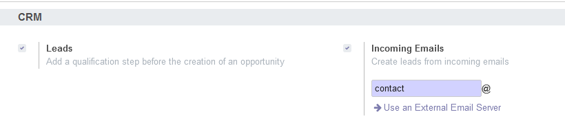

# CRM Customizations for odoo 14

## Description
This module adds specific customizations to the Odoo CRM module to meet the requirements defined in the technical test. It includes additional features for managing sales teams, notifications, and view configurations.

## Installation
1. Clone this repository into your Odoo addons directory.
2. Update the module list in Odoo.
3. Install the `CRM Customizations` module from the Odoo interface.

## Configuration
No additional configuration is required. The functionalities are triggered automatically upon module installation.

## Features

1. **Add an emails field to the sales team**:
   - Aggregates all emails of the sales team members, separated by commas.

2. **Automatically add the team leader to the list of members**:
   - Ensures that the team leader is always a member of the sales team by automatically adding them to the list of members.

3. **Create three sales teams**:
   Creates teams and attach to the existing company with specific configurations.
   - Technical Support Team
   - Sales Team
   - Customer Service Team

4. **Automatically check configuration parameters during module installation**.

   

5. **Notification for opportunities remaining in draft status for more than 10 days**:
   - Sends a notification to all members of the sales team associated with the opportunity.

6. **Visibility of the "Expected Revenue" field restricted to sales administrators**:
   - Makes the field visible only to the "Sales Manager" group.

7. **Assign default sales team for leads created via the contact form**:
   - Assigns leads created via the contact form to the "Sales Team" by default.

## License
This module is published under the AGPLv3 license.

## Author
- Manda Julien

## Contact
- (manda147julin@gmail.com)
